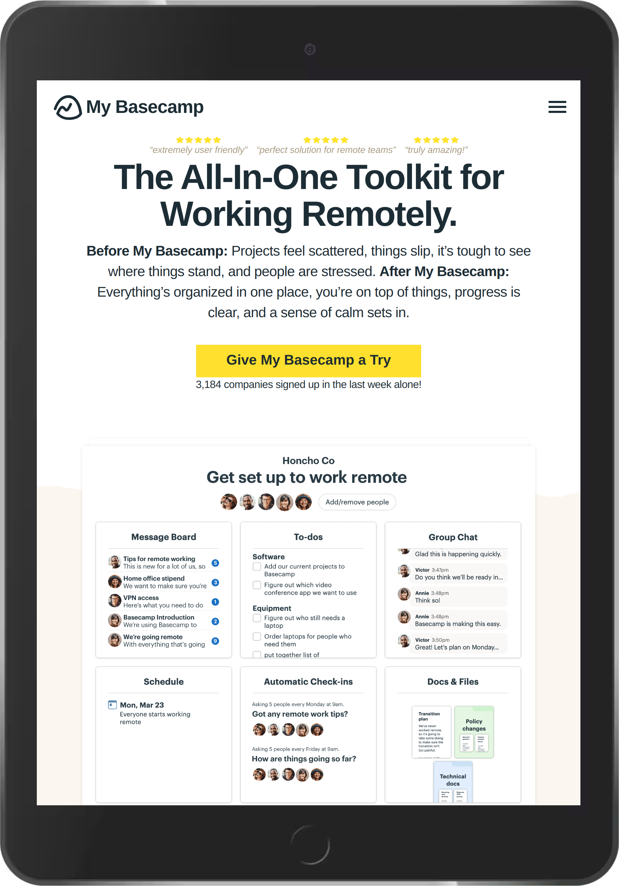
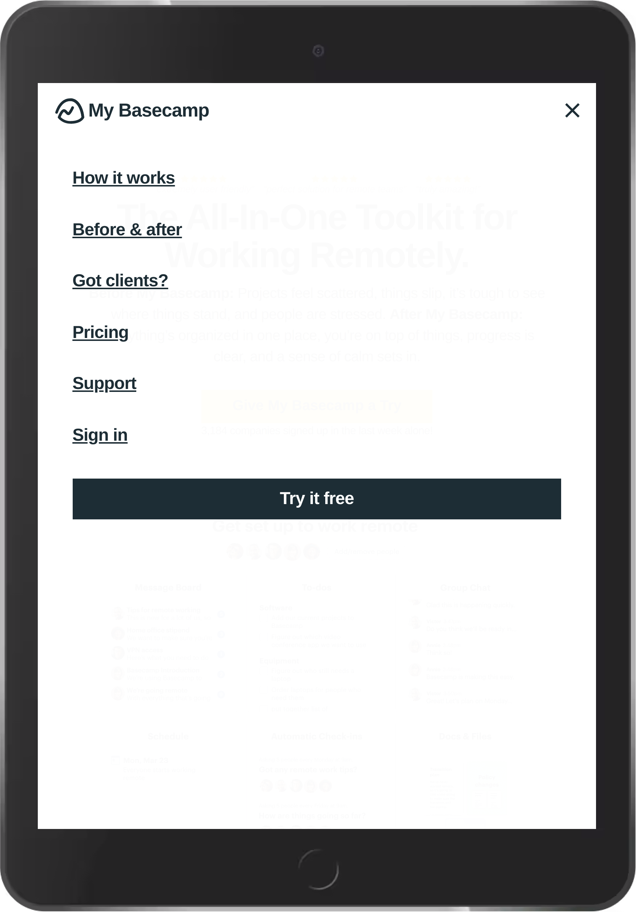
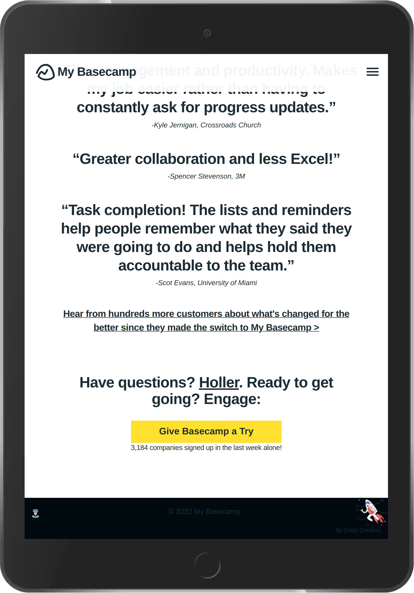

<h1 align="center">My Basecamp</h1>

<h2>Documentation:</h2>
<ul>
  <li><a href="#project-description"><b>Project Description</b></a></li>
  <li><a href="#getting-started"><b>Getting Started</b></a></li>
  <li><a href="#api-documentation"><b>API Documentation</b></a></li>
  <li><a href="#technology-stack"><b>Technology Stack</b></a></li>
</ul>

<!--Project Description-->

  <h2>Project Description</h2>
  
<b>My Basecamp</b> is web-based software that implements the Basecamp project management tool.
 
  

    
    
    
  

<!--Getting Started-->

  <h2>Getting Started</h2>
  <ol type="1">
    <li>
      <h3>Try My Basecamp Online</h3>
      
Go to <a href="https://my-basecamp-app.herokuapp.com">My Basecamp</a> ⚡️

    </li> 
    <li>
      <h3>Installing && Running My Basecamp Locally</h3>
      
Soon ...

    </li>
  </ol>

<!--API Documentation-->

  <h2>API Documentation</h2>
  
Soon ...

<!--Technology Stack-->

  <h2>Technology Stack</h2>
  <ul> 
    <li>HTML5</li>
    <li>CSS3 > Bootstrap, RedM, Sass</li>
    <li>JavaScript > Lottie</li>
    <li>Ruby > Ruby on Rails, Devise</li>
    <li>Database > PostgreSQL</li>
    <li>Heroku</li>
    <li>Git | GitHub</li>
  </ul>

