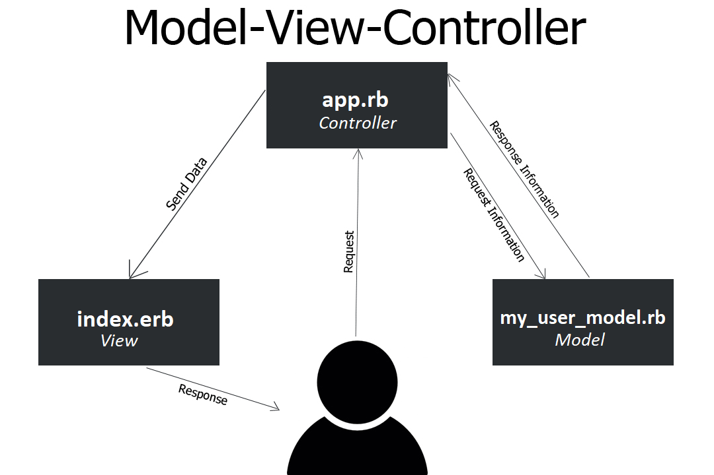

<h1 align="center">My Users App</h1>

<h2>Documentation:</h2>
<ul>
    <li><a href="#project-description"><b>Project Description</b></a></li>
    <li><a href="#getting-started"><b>Getting Started</b></a></li>
    <li><a href="#the-api-documentation"><b>The API Documentation</b></a></li>
    <li><a href="#technology-stack"><b>Technology Stack</b></a></li>
</ul>

<!--Project Description-->

    <h2>Project Description</h2>
    
<b>My Users App</b> is a Web-Application that was implemented using the very famous Architecture Pattern > <b>MVC | Model View Controller</b>.

    
<b>MVC</b> is the most popular Architecture for building complex Web-Servers. It is used by many Frameworks, and implemented into nearly every modern Web-Application.

    
<b>MVC</b> divides application into 3-Components > Each with a specific responsibility.

    <ul>
        <li><b>Model</b></li>
        
The Model handles data validation, logic, and persistence. It interacts directly with the database to handle the data. The Controller will get all of its data information by asking the Model about the data.

        <li><b>View</b></li>
        
The View handles presenting the information. It will usually render dynamic HTML pages based on the data the model fetches. The Controller is responsible for passing that data between the Model and View, so that the Model and View never have to interact with each other.

        <li><b>Controller</b></li>
        
The Controller handles user requests and delegates information between the Model and the View. It only deals with requests, and never handles data or presentation.

    </ul>
    

        
    

    

        <h3>Additional Sources:</h3>
        <ul>
            <li><a href="https://www.youtube.com/watch?v=DUg2SWWK18I"><b>MVC Explained in 4 Minutes</b></a></li>
            <li><a href="#">...</a></li>
        </ul>
    

     
     
    
The main goal of this project was to get acquainted and implement a Web-Application using the MVC Architecture.

<!--Getting Started-->

    <h2>Getting Started</h2>
    <ol type="1">
        <li><h3>Installing && Running The Web-Application</h3></li>
            <ol type="1">
                <li><b>Clone the repository</b></li>
                    
<code>$ git clone git@github.com:Crazy-Creators-Zone/qwasar-silicon-valley.git</code>

                    
(This information will be updated soon)
 
                <li><b>Make sure the Ruby-Programming Language is installed</b></li>
                    
<code>$ ruby -v</code>

                    Your Terminal should display the Ruby version something like this:
                    
<code>$ ruby 3.0.2p107 (2021-07-07 revision 0db68f0233) [x86_64-linux]</code>

                    
Otherwise, you will need to install Ruby > Follow this link
                        <a href="https://www.ruby-lang.org/en/documentation/installation/" target="_blank">Ruby Installation Guide</a>
                    
 
                <li><b>Make sure the Bundle Gem is installed</b></li>
                    
<code>$ bundle -v</code>

                    Your Terminal should display the Bundler version something like this:
                    
<code>$ Bundler version 2.2.29</code>

                    Otherwise, you will need to install Bundle Gem
                    
<code>$ gem install bundler</code>
 
                <li><b>Move to <code>my_users_app</code> Directory</b></li>
                    
<code>$ cd my_users_app</code>
 
                <li><b>Run the following command to install all the required Gems that are listed in the Gemfile</b></li>
                    
<code>$ bundle install</code>
 
                <li><b>Move to <code>app/сontrollers</code> Directory and Run the Web-Server</b></li>
                    
<code>$ cd app/controllers</code>

                    
<code>$ ruby app.rb</code>
 
                <li><b>Go to <code>http://localhost:8090/users</code> And you'll see > All Users-Data</b></li> 
            </ol> 
        <li><h3>Running The Built-In Tests</h3></li>
            <ul>
                <li><b>Running tests to test the Program Code > app.rb</b></li>
                <ol type="1">
                    <li>Move to <code>app/сontrollers</code> Directory and Run the Web-Server</li>
                        
<code>$ cd app/controllers</code>

                        
<code>$ ruby app.rb</code>
 
                    <li>Open an additional Terminal window and Move to <code>spec/controllers</code> Directory</li>
                        
<code>$ cd spec/controllers</code>
 
                    <li>Run the tests gandalf.sh</li>
                        
<code>$ sh gandalf.sh</code>
 
                </ol>
                <li><b>Running tests to test the Program Code > my_user_model.rb</b></li>
                <ol type="1">
                    <li>Move to <code>spec/models</code> Directory and Run the tests gandalf.rb</li>
                        
<code>$ cd spec/models</code>

                        
<code>$ ruby gandalf.rb</code>

                </ol>
            </ul>
    </ol>

<!--The API Documentation-->

    <h2>The API Documentation</h2>
    <h3>Classes:</h3>
    <ul>
        <li><b>ConnectionSqlite</b></li>
            <ul>
                <li><b>Method <code>create_db()</code></b></li>
                
This Method is used to > Create Tables in a Database.

                Method have to:
                <ol type="1">
                    <li>Takes as Input > 1-Argument > It must be an Open Database</li>
                    <li>Executes SQL-Scripts > To Build Tables in the Database</li>
                    <li>Returns as Output > Constructed Tables in the Database</li>
                </ol>  
                <li><b>Method <code>db_connection()</code></b></li>
                
This Method is used to > Connect to the Database.

                Method have to:
                <ol type="1">
                    <li>Takes as Input > 1-Argument > SQL-Query</li>
                    <li>Opens the Database</li>
                    <li>Executes SQL-Query</li>
                    <li>Returns as Output > The response from the Database as an Array</li>
                    The Array Data varies depending on the type of Query > In other words which of the <b>CRUD-Operations</b> was performed:
                    <ul>
                        <li>If the Query is a <b>Create-Operation</b>  > The Database will return an Empty Array</li>
                        <li>If the Query is a <b>Read-Operation</b>    > The Database will return an Array containing certain data</li>
                        <li>If the Query is a <b>Update-Operation</b>  > The Database will return an Empty Array</li>
                        <li>If the Query is a <b>Destroy-Operation</b> > The Database will return an Empty Array</li>
                    </ul>
                </ol>  
            </ul> 
        <li><b>User</b></li>
            <ul>
                <li><b>Method <code>to_h_with_adding_keys(array)</code></b></li>
                
This Method is used to > Convert an Array Data type to a Hash Data type with the addition of keys.

                Method have to:
                <ol type ="1">
                    <li>Takes as Input > 1-Argument: <code>array</code> > In Array Data type</li>
                    <li>Creates special Keys</li>
                    <li>Converts <code>array</code> Argument to a Hash with the addition of Keys</li>
                    <li>Returns as Output > Hash Data type</li>
                </ol>  
                <li><b>Method <code>check_duplicates(user_info)</code></b></li>
                
This Method is used to > Сheck the Database for duplicate data.

                Method have to:
                <ol type="1">
                    <li>Takes as Input > 1-Argument: <code>user_info</code> > In Array Data type</li>
                    <li>Queries all users data from the Database</li>
                    <li>Checks the Received Array from the Database > For the existence of any users data</li>
                    <li>Checks the Received Array from the Database > With the <code>user_info</code> Argument, comparing the mail data of the users</li>
                    <li>Returns as Output > :</li>
                        <ul>
                            <li><code>EXIT_SUCCESS</code> > If duplicates are not found</li>
                            <li><code>EXIT_FAILURE</code> > If duplicates are found</li>
                        <ul>
                </ol>  
                <li><b>Method <code>create(user_info)</code></b></li>
                
This Method is used to > Create a New User in the Database.

                The Algorithm of the Method:
                <ol type="1">
                    <li>Takes as Input > 1-Argument: <code>user_info</code> > In Array Data type</li>
                    <li>Checks for the existence of the <code>user_info</code> in the Database</li>
                    <li>Sends the SQL-Query using <code>user_info</code> to create a new user to the Database</li>
                    <li>Checks whether the new user has been created in the Database</li>
                    <li>Returns as Output > :</li>
                        <ul>
                            <li>Hash Data > <code>result = {:value => true, :description => ...}</code> > If the <code>user_info</code> User has been successfully created in the Database</li>
                            <li>Hash Data > <code>result = {:value => false, :description => ...}</code> > If the <code>user_info</code> User has not been created in the Database</li>
                            <li>Hash Data > <code>result = {:value => false, :description => ...}</code> > If the <code>user_info</code> User already exists in the Database</li>
                        </ul>
                </ol>  
                <li><b>Method <code>get(uniq_user_id)</code></b></li>
                
This Method is used to > Retrieve User Data from the Database.

                The Algorithm of the Method:
                <ol type="1">
                    <li>Takes as Input > 1-Argument: <code>uniq_user_id</code> > In Integer Data type</li>
                    <li>Sends the SQL-Query using <code>uniq_user_id</code> to retrieve data from the Database</li>
                    <li>Checks the Received Array from the Database > For the existence of user data</li>
                    <li>Converts the Received Array from the Database > Into a Hash Data with the addition of keys</li>
                    <li>Returns as Output > :</li>
                        <ul>
                            <li>Hash containing user data > If user exists in the Database</li>
                            <li>Null > If the user doesn't exist in the Database</li>
                        </ul>
                </ol>  
                <li><b>Method <code>all()</code></b></li>
                
This Method is used to > Retrieve All Data of All Users from the Database

                The Algorithm of the Method:
                <ol type="1">
                    <li>Takes as Input > Nothing</li>
                    <li>Sends an SQL-Query to retrieve all data of all users from the Database</li>
                    <li>Checks the Received Array from the Database > For the existence of users data</li>
                    <li>Converts the Received Array from the Database > Into a Hash Data with the addition of keys</li>
                    <li>Returns as Output > :</li>
                         <ul>
                            <li>Hash containing users data > If users exist in the Database</li>
                            <li>Null > If the users don't exist in the Database</li>
                        </ul>
                </ol>  
            </ul> 
    </ul>

<!--Technology Stack-->

    <h2>Technology Stack</h2>
    
Soon ...

